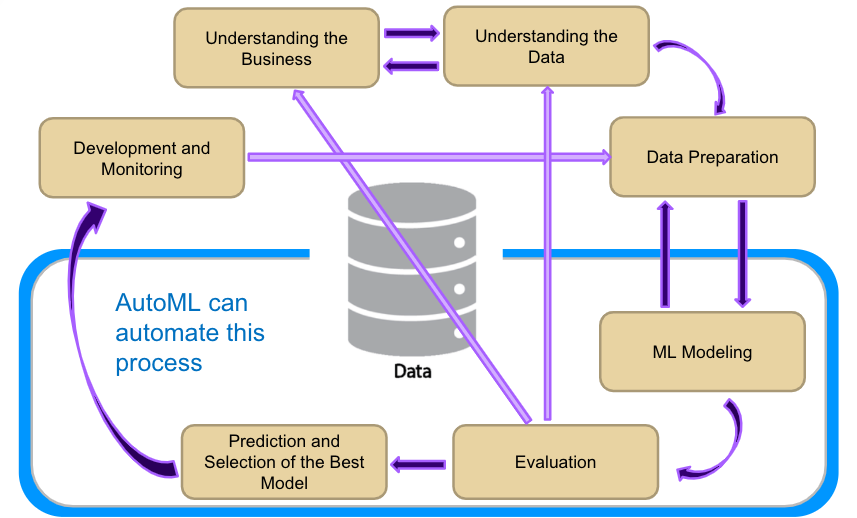
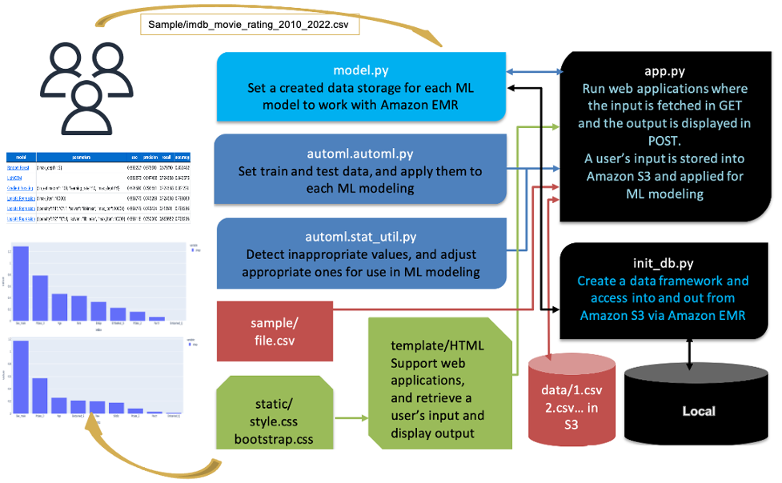
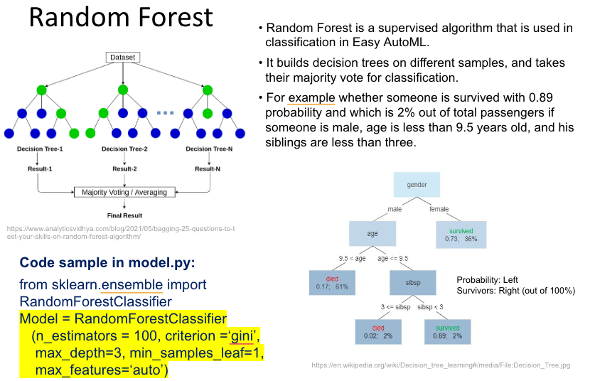
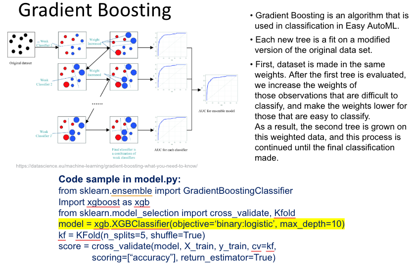
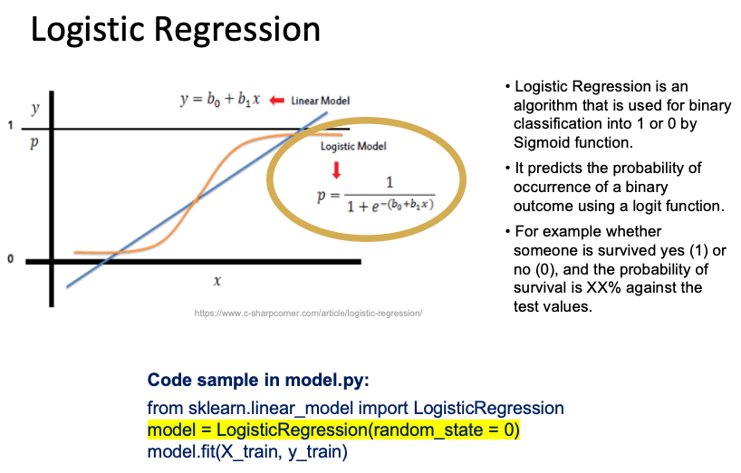

# What is AutoML?
* The lack of comparison views for the output metrics that are generated by multiple machine learning (ML) models renders the determination of insights from datasets difficult for users. 
Generating ML models also requires iterative processes, covering the understanding of data to the tuning of model parameters.

* AutoML implements functions and storages that can accelerate the development of ML models. 
The selection of ML modeling, the modeling process itself, the user’s input, and ML modeling output are automated. 
Users can evaluate the output metrics generated by various ML models against one another in one summary view.
Output metrics help users select the most and least successful models for a given business scenario.


# AutoML
* While a machine learning(ML) project requires iterative proceses from understanding data to tuning model parameters in order to develop a optimal model for data, some tasks in the analysis process can be automated. AutoML implements functions to accelerate the process of developing the ML model.


# Output view and metrics
* Users can review their uploaded CSV files in the summary view. 
* Quality columns show them how input data look.
* After ML modeling, area under the curve (AUC), precision, recall, and accuracy values are displayed.
* For Spark in Local, SHapley Additive exPlanations (SHAP) is generated in histgram by clicking the ML model names, so that users can figire which category values impact the most in the ML modeling. SHAP is a method of explaining individual predictions. A positive SHAP value means a positive impact on prediction. In AutoML, SHAP values are converted to absolute values, and displayed in a histgram.
 
# Users profile
* Our target users are those who want to analyze data and have the results represented in multiple ML models.
* To run the AutoML application, users should download required libraries and run Python modules (see Install on your mac section).

# Data sources
IMDb (an abbreviation of Internet Movie Database) is an online database of information related to films, television series, home videos, video games, and streaming content online – including cast, production crew and personal biographies, plot summaries, trivia, ratings, and fan and critical reviews. The earliest movie or TV show start year is 1888 and continue to be provided by 2024. IMDb is owned and operated by IMDb.com, Inc., a subsidiary of Amazon.
###
* IMDb dataset definitions are here: https://www.imdb.com/interfaces/ 
* IMDb files can be downloaded from here: https://datasets.imdbws.com/ 
For AutoML, title.basics.tsv.gz and title.ratings.tsv.gz are applied, then joined and modified in R for the AutoML input.
###
For testing AutoML, movies as a `titleType` and `startYear` between 2010 and 2020 are filtered and used from the movie dataset, and rating dataset is used as it is.
Each `primaryTitle` is categorized as one or more genres. New columns such as are added such as rateHighLow, voteHighLow, and rateGraterThan8 are added for the AutoML inference.

# R in dataset preparation
```
install.packages("tidyverse")
install.packages("readr")
install.packages("dplyr")
install.packages("scales")
install.packages("ggsci")
library(tidyverse)
library(ggplot2)
library(dplyr)
library(readr)
library(scales)
library(ggsci)

#################################################################################
# Prepare dataset to join basic_movie and rating between 2010 and 2022
#################################################################################

# Read dataset
movie_df <- read.csv("data/title.basics_movie.csv") 

# Unpivot movie dataset, and join rating dataset
movie_unpivot_df <- movie_df %>%
  filter(startYear != "\\N" & runtimeMinutes != "\\N") %>%
  separate_rows(genres, sep = ",") %>%
  filter(genres != "\\N") %>%
  filter(startYear >= 2010 & startYear <= 2022) %>%
  select(tconst, primaryTitle, isAdult, startYear, runtimeMinutes, genres)
#View(movie_unpivot_df)

# Remove unnecessary object to save RAM spaces
rm(list = c("movie_df"))

# Read dataset
rating_df <- read_tsv("data/title.ratings.tsv") 

# Join movie and ranking by tconst
movie_rating_df <- 
  left_join(movie_unpivot_df, rating_df, by = "tconst") %>%
  na.omit(numVotes) %>%
  na.omit(averageRating)
#View(movie_rating_df)

# Remove unnecessary object to save RAM spaces
rm(list = c("rating_df"))
rm(list = c("movie_unpivot_df"))

# Add greater than equal average rate as 1 and less than average rate as 0, and 
# greater than equal average number of vote as 1 ad less than average as 0, and
movie_rate_binary_df <- movie_rating_df %>%
  mutate(rateHighLow = ifelse(averageRating >= sum(averageRating * numVotes)/sum(numVotes), 1, 0)) %>% #[1] 6.860613
  mutate(voteHighLow = ifelse(numVotes >= mean(numVotes), 1, 0)) %>% #[1] 6028.553
  mutate(rateGreaterThan8 = ifelse(averageRating >= sum(8 * numVotes)/sum(numVotes), 1, 0))
#View(movie_rate_binary_df)

# Save df as csv
write.csv(movie_rate_binary_df, "data/imdb_movie_rating_2010_2022.csv", row.names = FALSE)

# Remove unnecessary object to save RAM spaces
rm(list = c("movie_rating_df"))
```

# How the dataset is applied in AutoML?
Any comma-separated value (CSV) files can be uploaded onto AutoML. Sample dataset is prepared and stored as sample/imdb_movie_rating_2010_2022.csv.
A user’s uploaded files are stored in the data folder as 1.csv, 2.csv, and so on in Spark in Local.

# Variables for ML modeling
### Target variables
* The variable that AutoML recommends from a list of prospects is the target (predictor) variable selected for ML modeling.

### Category variables
* As a default, AutoML detects variables that cannot be used for ML modeling because they are non-numerical expressions, such as cabin (C85, C123, etc.), embarked (S, C, and Q), name (Braund, Mr. Owner Harris, etc.), and ticket (AJ5 21171, 113803, etc.). ]
* In addition to default detection, the selection of more category variables is necessary. These variables should be assigned numerical expressions 1 or 0, and one of them is dropped by get_dummies function with drop_first = True.


### Unused variables 
* By default, AutoML identifies variables that are inappropriate for use in ML modeling, such as those with an excessive number of missing values, too many unique values, and so on. Aside from carrying out default detection, users are required to select more unused variables on the basis of their decisions.

### Variables in evaluation metrics
* AUC score: Receiver Operating Characteristic (ROC) = FPR*chi + TPR
* Precision score: TP/(TP+FP)
* Recall score: TP/(TP+FN)
* Accuracy score: (TP+TN)/(TP+TN+FP+FN) 

# Install on your mac

```
git clone git@github.com:ykmorimoto/automl.git
cd automl
python3 -m venv .
source ./bin/activate
pip install --upgrade pip

# the following might be needed to fix pip install lightgbm on mac
# brew install libomp

pip install -r requirements.txt

python3 init_db.py (once input.db has been created, you don't need to run this again)
python3 app.py
# open 127.0.0.1:5000 on your browser
```

# App structure

```
.
├── data (destination to save csv)
├── images (images to refine README)
├── sample (sample data to try AutoML)
├── static (HTML components)
├── templates (HTML templates)
│   └── base.html
│   └── detail.html
│   └── experiment.html
│   └── index.html
│   └── variable.html
├── automl (func set)
│   └──automl_spark.py (support Spark on AutoML)
│   └──automl.py (support Spark in Local)
│   └──stat_util.py (convert non-numerical to numerical)
├── README.md (instructions how to run AutoML)
├── app.py (run web applicaitons)
├── init_db.py (create data framework for Spark on AutoM and Spark in Local)
├── input.db (generated by init_db.py)
├── model.py
└── requirements.txt
└── LICENSE
```


# Features
* Register csv datasets and manage experiment variables per dataset

* Provide useful comments to check data quality (missing value, uniques, and outliers)

* Visualize data distribution per variable to understand data
Applied category variables

Not applied category variables - too many missing values

Not applied category variables - too many unique values

* Internally non-numerical expressions are converted to numerical expressions 1 or 0
 
* Fit multiple ML models automatically and compare statistical scores

* Display ML models in graph for Spark in Local


# Algorithms
Here are some ML model diagram and algorithms are explained in code sample in AutoML.




# Future enhancement
* Increase the number of comparable ML models
* Add functions to tune multiple parameters by grid search.