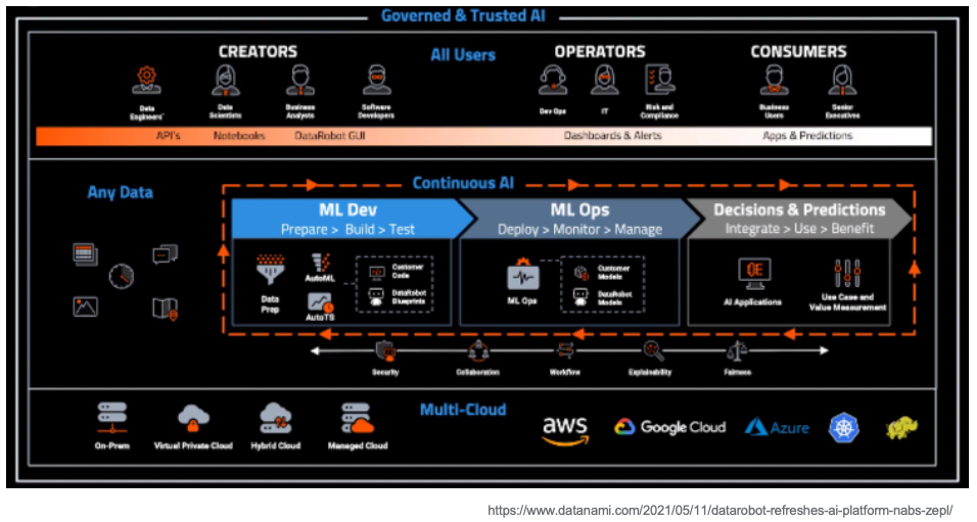
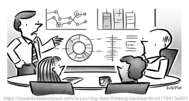
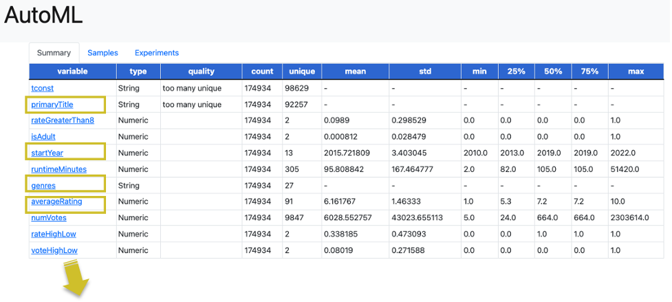
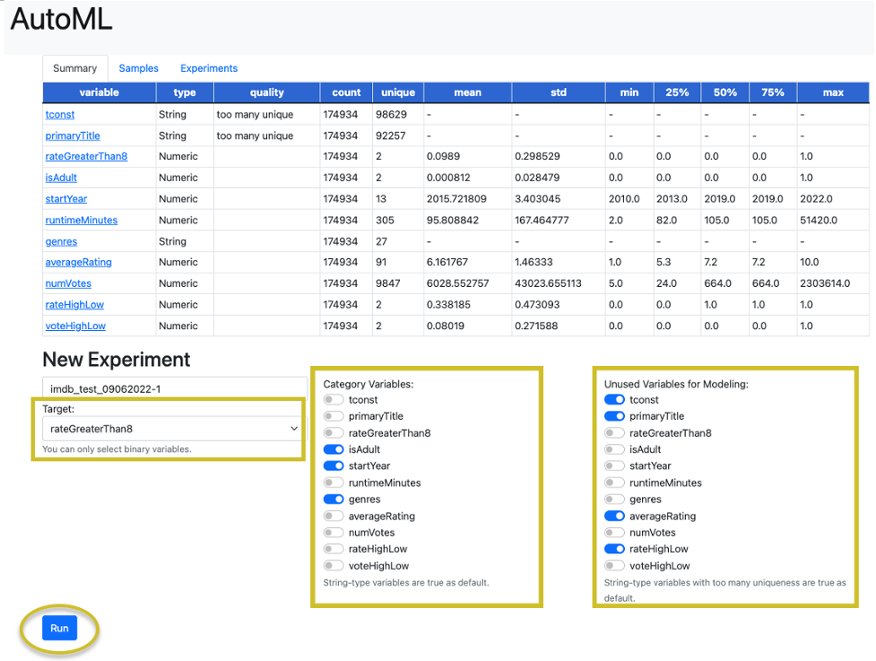
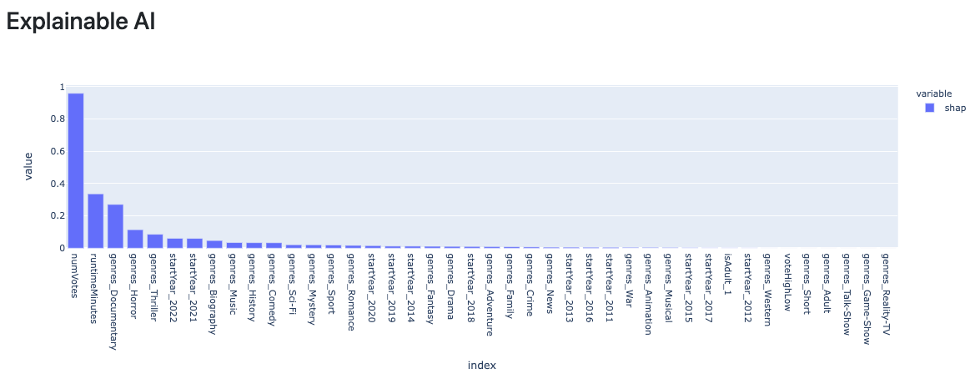
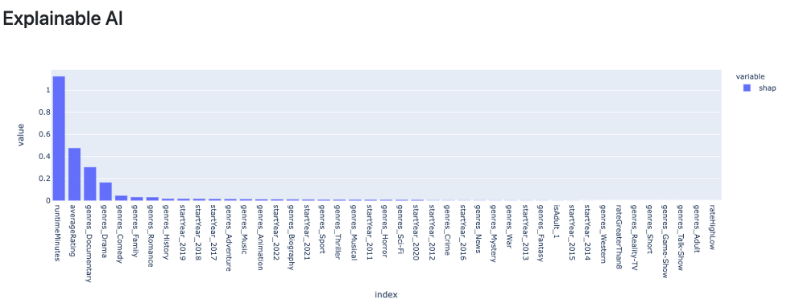
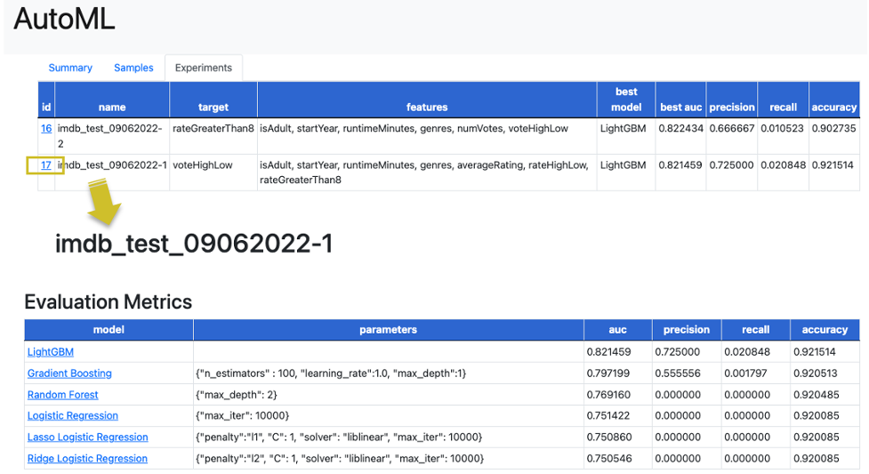

# Analysis of ML Modeling IMDb movie data in AutoML 


# What is AutoML?
* When users lack a comparative view of the output metrics generated by multiple machine learning (ML) models, it is hard for them to derive insights from datasets. Generating ML models also requires iterative processes that range from interpretation of the data to tuning of model parameters.


* AutoML implements functions and storage capability that can accelerate the development of ML models. The selection of ML modeling, the modeling process itself, the user’s input, and the ML modeling output are all automated. Users can compare the output metrics generated by various ML models in a single summary view. Output metrics help users determine which models would be the least or most successful in a given business scenario.
<p align="center">

</p>


# AutoML
* An ML project requires iterative processes that range from interpretation of data to tuning of model parameters performed for the sake of developing an optimal model for the data. But some of these analytical tasks can be automated, and AutoML implements functions that accelerate development of the ML model.
<p align="center">

</p>


# Output view and metrics
* Users can review the CSV files that they have uploaded in a summary view.
* Quality columns show what the input data looks like.
* After ML modeling, area under the curve (AUC), precision, recall, and accuracy values are displayed.
* For Spark in Local, SHapley Additive exPlanations (SHAP) is generated in a histogram by clicking the ML model names, enabling users to determine which category values most impact the target value in the ML modeling. SHAP is a method of explaining individual predictions. A positive SHAP value means a positive impact on prediction. In AutoML, SHAP values are converted to absolute values and displayed in a histogram.


# User's profile
* Our target users are users who want to analyze data and to have the results represented in multiple ML models.
* To run the AutoML application, users download required libraries and run Python modules (see the  `Install on your mac` section).


# Data sources
The Internet Movie Database (IMDb) is an online database about films, television series, home videos, video games, and online streaming content. The information includes names of cast members and production crew members and biographies, plot summaries, trivia, ratings, and reviews by critics and fans. The earliest date of a listed movie or TV show is 1888; the latest date for a listed production, 2024, is for productions that will be completed or released in that year. IMDb is owned and operated by IMDb.com, Inc., a subsidiary of Amazon.

###
* You can find IMDb dataset definitions at https://www.imdb.com/interfaces/
* You can download IMDb files from https://datasets.imdbws.com/
For AutoML, title.basics.tsv.gz and title.ratings.tsv.gz are applied, then joined and modified in R for the AutoML input.

###
For AutoML testing, movies from the movie dataset are filtered by `titleType` and `startYear` between 2010 and 2020. The rating dataset is used as is.
Each `primaryTitle` is categorized as one or more genres. New columns such as rateHighLow, voteHighLow, and rateGreaterThan8 are added as target variables for the AutoML prediction.
* rateHighLow: set at 1 if the rate is greater than or equal to the average rate; set at 0 if the rate is lower than the average rate.
* voteHighLow: set at 1 if the number of votes is greater than or equal to the average number; set at 0 if the number of votes is lower than the average number.
* rateGreaterThan8: set at 1 if the rate is greater than or equal to the average rate of 8.0 (the scale is 1.0 to 10.0); set at 0 if the rate is lower than the average rate of 8.0.


# R in dataset preparation
```
install.packages("tidyverse")
install.packages("readr")
install.packages("dplyr")
install.packages("scales")
install.packages("ggsci")
library(tidyverse)
library(ggplot2)
library(dplyr)
library(readr)
library(scales)
library(ggsci)

#################################################################################
# Prepare dataset to join basic_movie and rating between 2010 and 2022
#################################################################################

# Read dataset
movie_df <- read.csv("data/title.basics_movie.csv") 

# Unpivot movie dataset, and join rating dataset
movie_unpivot_df <- movie_df %>%
  filter(startYear != "\\N" & runtimeMinutes != "\\N") %>%
  separate_rows(genres, sep = ",") %>%
  filter(genres != "\\N") %>%
  filter(startYear >= 2010 & startYear <= 2022) %>%
  mutate(startYear = as.character(startYear)) %>%
  select(tconst, primaryTitle, isAdult, startYear, runtimeMinutes, genres)
#View(movie_unpivot_df)

# Remove unnecessary object to save RAM spaces
rm(list = c("movie_df"))

# Read dataset
rating_df <- read_tsv("data/title.ratings.tsv") 

# Join movie and ranking by tconst
movie_rating_df <- 
  left_join(movie_unpivot_df, rating_df, by = "tconst") %>%
  na.omit(numVotes) %>%
  na.omit(averageRating)
#View(movie_rating_df)

# Remove unnecessary object to save RAM spaces
rm(list = c("rating_df"))
rm(list = c("movie_unpivot_df"))

# Add greater than equal average rate as 1 and less than average rate as 0, and 
# greater than equal average number of vote as 1 ad less than average as 0, and
movie_rate_binary_df <- movie_rating_df %>%
  mutate(rateHighLow = ifelse(averageRating >= sum(averageRating * numVotes)/sum(numVotes), 1, 0)) %>% #[1] 6.860613
  mutate(voteHighLow = ifelse(numVotes >= mean(numVotes), 1, 0)) %>% #[1] 6028.553
  mutate(rateGreaterThan8 = ifelse(averageRating >= sum(8 * numVotes)/sum(numVotes), 1, 0))
#View(movie_rate_binary_df)

# Save df as csv
write.csv(movie_rate_binary_df, "data/imdb_movie_rating_2010_2022.csv", row.names = FALSE)

# Remove unnecessary object to save RAM spaces
rm(list = c("movie_rating_df"))
```

# How the dataset is applied in AutoML
Any comma-separated value (CSV) files can be uploaded to AutoML. A sample dataset is prepared and stored as sample/imdb_movie_rating_2010_2022.csv.
A user’s uploaded files are stored in the data folder as 1.csv, 2.csv, and so on in Spark in local.


# Variables for ML modeling
### Target variables
* The variable that AutoML recommends from a list of prospects is the target (predictor) variable selected for ML modeling.

### Category variables
* By default, AutoML detects variables that cannot be used for ML modeling because they are nonnumerical expressions.
* In addition to default detection, the user's selected variables in `Category Variables` should be assigned numerical expressions of 1 or 0, and one of them is dropped by the get_dummies function with drop_first = True.


### Unused variables 
* By default, AutoML identifies variables that are inappropriate for use in ML modeling, such as those with an excessive number of missing values, too many unique values, and so on. In addition to carrying out default detection, users are required to select more unused variables on the basis of their decisions.

### Variables in evaluation metrics
TP: True Positive, TN: True Negative, FP: False Positive, and FN: False Negative
* AUC score: Receiver Operating Characteristic (ROC) = FPR*chi + TPR (if AUC score is below 0.5, the prediction output can not be trusted) 
* Precision score: TP/(TP+FP)
* Recall(Sensitivity) score: TP/(TP+FN)
* Accuracy score: (TP+TN)/(TP+TN+FP+FN)


# Install on your mac

```
git clone git@github.com:ykmuw/automl.git
cd automl
python3 -m venv .
source ./bin/activate
pip3 install --upgrade pip

# the following might be needed to fix pip install lightgbm on mac
# brew install libomp

pip3 install -r requirements.txt

python3.9 init_db.py (once input.db has been created, you don't need to run this again)
python3.9 app.py
# open 127.0.0.1:5000 on your browser
```
Logs when AutoML is executed:
  


# App structure

```
.
├── data (destination to save csv)
├── images (images to refine README)
├── sample (sample data to try AutoML)
├── static (HTML components)
├── templates (HTML templates)
│   └── base.html
│   └── detail.html
│   └── experiment.html
│   └── index.html
│   └── variable.html
├── automl (func set)
│   └──automl_spark.py (support Spark on AutoML)
│   └──automl.py (support Spark in Local)
│   └──stat_util.py (convert non-numerical to numerical)
├── README.md (instructions how to run AutoML)
├── app.py (run web applicaitons)
├── init_db.py (create data framework for Spark on AutoM and Spark in Local)
├── input.db (generated by init_db.py)
├── model.py
└── requirements.txt
└── LICENSE
```


# AutoML features
* Select sample/imdb_movie_rating_2010_2022.csv from user's local folder through `Choose File` button and click `Import a new dataset`. 
<p align="center">
  
</p>

* AutoML registers the dataset that the user has uploaded and displays string-type as default in `Category Variables`; it also displays string-type as default in `Unused Variables for Modeling` if the value contains too many unique variables.
<p align="center">
  
</p>

* AutoML provides users with a summary of uploaded file data in the `Summary` tab and of data samples in the `Samples` tab. Useful comments are available to check the quality of the data (missing value, unique, and outliers).
<p align="center">
  
  
</p>

* AutoML helps users to better understand the data by visualizing the data distribution per variable when they click each variable link.


* Applied category variables - skewed distribution

* Applied category variables - normal distribution


* Not applied category variables - too many unique values


* Users can select a binary object variable in `Target` that they want to predict, select appropriate values in `Category Variables` that they want to use as categories in ML modeling, and select appropriate unused values in `Unused Variables for Modeling` as shown below, then click `Run`.



# AutoML evaluation metrics
* AutoML fits multiple ML models automatically and provides users with comparable statistical scores. Users can click each ML model link to observe output in a graph.

### Output of target binary variables as `rateGreaterThan8`  


* <ins>LightGBM</ins>  
_NumVotes, runtimeMinutes, and genres_Documentary have the most impact on the rateGreaterThan8 prediction._


* <ins>Random Forest</ins>  
_NumVotes, genres_Documentary, and runtimeMinutes have the most impact on the rateGreaterThan8 prediction._


* <ins>Ridge Logistic Regression</ins>  
_RuntimeMinutes has the most impact on the rateGreaterThan8 prediction, and genres_Documentary and genres_Drama have some impact on the rateGreaterThan8 prediction._


### Output of target binary variables as `voteHighLow`  


* <ins>LightGBM</ins>  
 _RuntimeMinutes has the most impact on the voteHighLow prediction, and averageRating, genres_Documentary, and genres_Dorama have some impact on the voteHighLow prediction._


* <ins>Gradient Boosting</ins>  
_RuntimeMinutes, averageRating, genres_Documentary have the most impact on the voteHighLow prediction, and genres_Drama have some impact on the voteHighLow prediction._


* <ins>Logistic Regression</ins>  
_Genres_Documentary has the most impact on the voteHighLow prediction, and averageRating, rateGreatehrThan8, and runtimeMinutes have an equal impact on the voteHighLow prediction._


### Evaluated results are stored in the `Experiments` tab 
* Clicking `id` returns the user to the Evaluation Metrics page



# Algorithms
Here are some ML model diagrams and algorithms and the algorithm code sample that is used in AutoML.
<p align="center">
  
</p>
<p align="center">
  
</p>
<p align="center">
  
</p>


# Future enhancement
* Increase the number of comparable ML models.
* Add functions to tune multiple parameters by grid search.
* Replace local with Apache Spark on EMR (Hadoop) on EC2 with S3.
